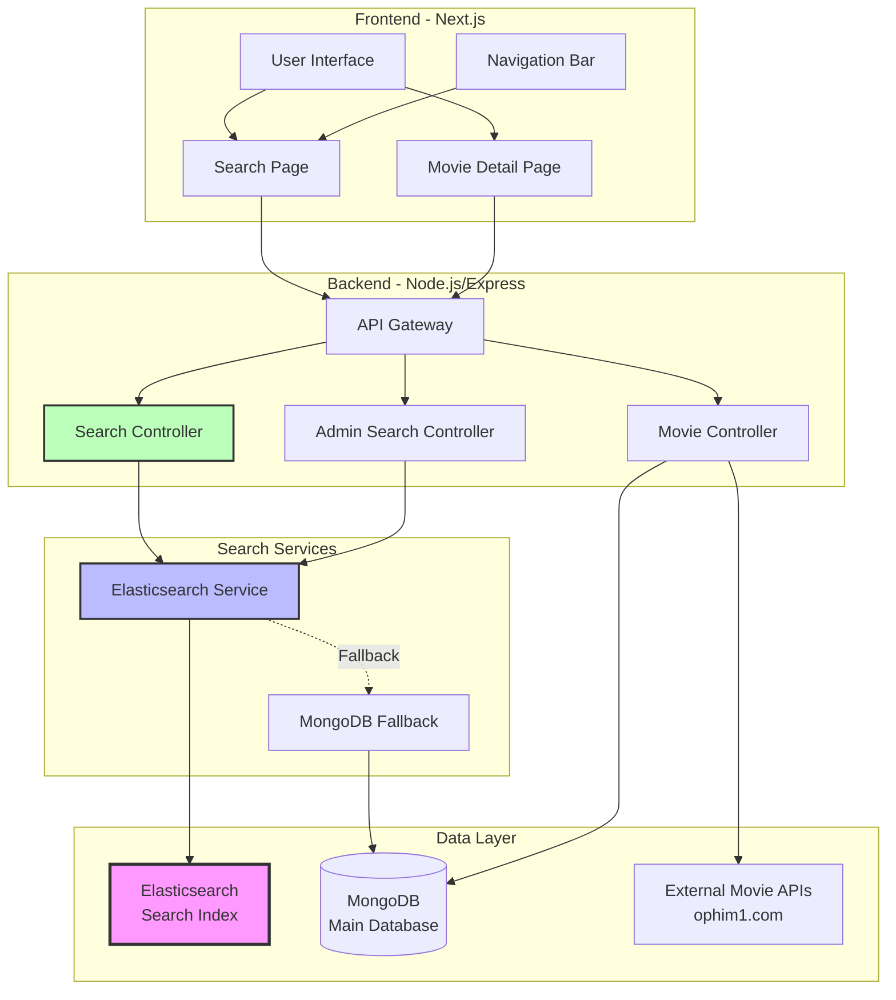
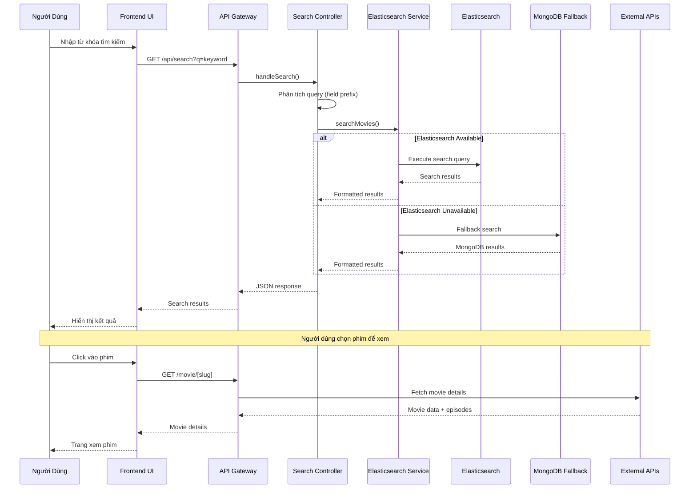
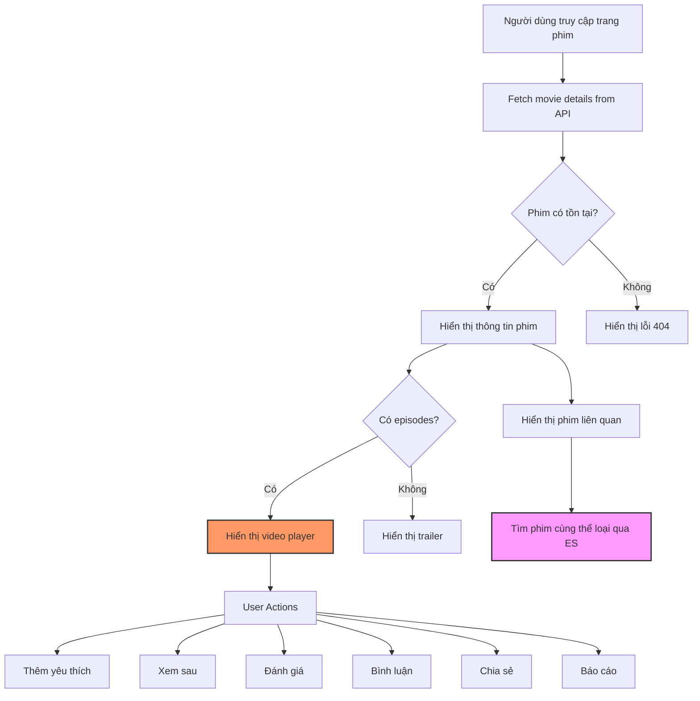
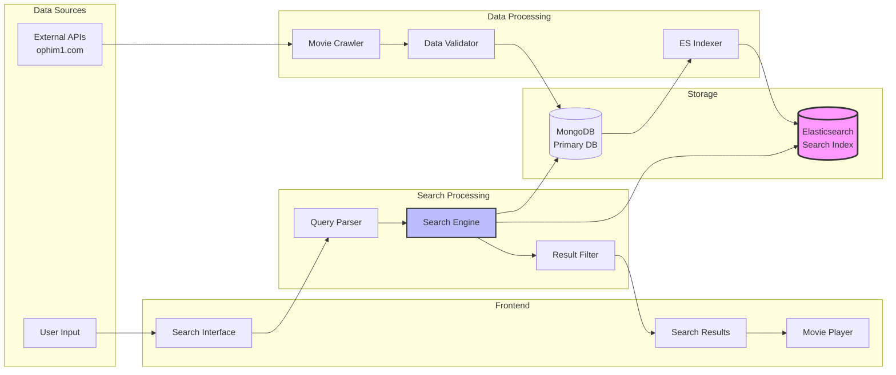

# Sơ Đồ Tổng Quan - Hệ Thống Xem Phim & Tìm Kiếm Thông Minh với Elasticsearch

## 🎬 Kiến Trúc Tổng Quan



## 🔍 Luồng Tìm Kiếm Thông Minh



## 🎯 Các Tính Năng Tìm Kiếm Thông Minh

### 1. **Multi-Field Search**
```javascript
// Hỗ trợ tìm kiếm theo nhiều trường
const supportedFields = [
    'name',         // Tên phim
    'origin_name',  // Tên gốc
    'actor',        // Diễn viên
    'director',     // Đạo diễn
    'content',      // Nội dung
    'category',     // Thể loại
    'country',      // Quốc gia
    'year',         // Năm
    'lang',         // Ngôn ngữ
    'status',       // Trạng thái
    'type',         // Loại phim
    'slug'          // Slug
];
```

### 2. **Smart Query Parsing**
```
name:Avengers          // Tìm trong trường name
actor:Tom Cruise       // Tìm theo diễn viên
category:Action        // Tìm theo thể loại
year:2023             // Tìm theo năm
```

### 3. **Advanced Filtering**
- Thể loại (Category)
- Quốc gia (Country)
- Năm sản xuất (Year)
- Loại phim (Series/Single)
- Trạng thái (Active/Inactive)

## 🎮 Luồng Xem Phim



## 🏗️ Cấu Trúc Database & Index

### MongoDB Schema
```javascript
// Movie Schema
{
  _id: ObjectId,
  name: String,           // Tên phim
  origin_name: String,    // Tên gốc
  slug: String,           // URL slug
  content: String,        // Mô tả nội dung
  type: String,           // "series" hoặc "single"
  status: String,         // Trạng thái phim
  poster_url: String,     // URL poster
  thumb_url: String,      // URL thumbnail
  trailer_url: String,    // URL trailer
  time: String,           // Thời lượng
  episode_current: String,// Tập hiện tại
  episode_total: String,  // Tổng số tập
  quality: String,        // Chất lượng
  lang: String,           // Ngôn ngữ
  year: Number,           // Năm sản xuất
  actor: [String],        // Diễn viên
  director: [String],     // Đạo diễn
  category: [{            // Thể loại
    name: String,
    slug: String
  }],
  country: [{             // Quốc gia
    name: String,
    slug: String
  }],
  episodes: [{            // Danh sách tập phim
    server_name: String,
    server_data: [{
      name: String,
      slug: String,
      filename: String,
      link_embed: String,
      link_m3u8: String
    }]
  }],
  isHidden: Boolean,      // Ẩn/hiện phim
  createdAt: Date,
  updatedAt: Date
}
```

### Elasticsearch Mapping
```javascript
// Elasticsearch Index Mapping
{
  "mappings": {
    "properties": {
      "name": {
        "type": "text",
        "analyzer": "standard",
        "fields": {
          "keyword": {
            "type": "keyword"
          }
        }
      },
      "origin_name": {
        "type": "text",
        "analyzer": "standard"
      },
      "content": {
        "type": "text",
        "analyzer": "standard"
      },
      "actor": {
        "type": "text",
        "analyzer": "standard"
      },
      "director": {
        "type": "text", 
        "analyzer": "standard"
      },
      "category": {
        "type": "nested",
        "properties": {
          "name": {
            "type": "text",
            "analyzer": "standard"
          },
          "slug": {
            "type": "keyword"
          }
        }
      },
      "country": {
        "type": "nested", 
        "properties": {
          "name": {
            "type": "text",
            "analyzer": "standard"
          },
          "slug": {
            "type": "keyword"
          }
        }
      },
      "year": {
        "type": "integer"
      },
      "type": {
        "type": "keyword"
      },
      "status": {
        "type": "keyword" 
      },
      "isHidden": {
        "type": "boolean"
      }
    }
  }
}
```

## 🚀 API Endpoints

### Search APIs
```
GET /api/search?q=keyword&page=1&size=20
GET /api/search?q=name:Avengers&category=Action&year=2023
GET /api/suggestions?q=Av&limit=5
```

### Movie APIs  
```
GET /api/movies/:slug
GET /api/movies?category=action&limit=12
GET /movie/[slug] (Frontend route)
```

### Admin APIs
```
GET /api/admin/search?search=keyword&category=action
GET /api/admin/elasticsearch/status
```

## 🔧 Các Tính Năng Đặc Biệt

### 1. **Fallback Mechanism**
- Tự động chuyển sang MongoDB khi Elasticsearch không khả dụng
- Đảm bảo hệ thống luôn hoạt động ổn định

### 2. **Smart Query Processing**  
- Hỗ trợ tiền tố trường: `name:keyword`, `actor:name`
- Tự động phân tích và tối ưu query

### 3. **Advanced Filtering**
- Lọc theo thể loại, quốc gia, năm
- Hỗ trợ kết hợp nhiều bộ lọc

### 4. **Performance Optimization**
- Caching kết quả tìm kiếm
- Pagination hiệu quả
- Loại bỏ kết quả trùng lặp

### 5. **User Experience**
- Auto-suggestions khi gõ
- Related movies thông minh
- Responsive design cho mobile

## 🎥 Tính Năng Xem Phim

### 1. **Video Player**
- Hỗ trợ nhiều server
- Chọn chất lượng video
- Điều khiển tốc độ phát
- Fullscreen mode

### 2. **Episode Management**
- Danh sách tập phim
- Tự động chuyển tập
- Lưu tiến độ xem

### 3. **User Interactions**
- Thêm vào yêu thích
- Đánh dấu xem sau  
- Đánh giá phim
- Bình luận và thảo luận
- Chia sẻ phim
- Báo cáo lỗi

### 4. **Recommendations**
- Phim cùng thể loại
- Phim được đề xuất
- Phim mới cập nhật

---

## 📊 Luồng Dữ Liệu Chi Tiết



Sơ đồ này mô tả chi tiết kiến trúc và luồng hoạt động của hệ thống xem phim với tìm kiếm thông minh sử dụng Elasticsearch trong dự án của bạn.
